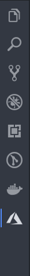

I have heard so much about serverless functions lately that I decided to just jump in and see what they were all about. There are a lot of options when you need to run a serverless function and all are pretty affordable. The big ones are Google Cloud Functions, IBM OpenWhisk, and Microsoft Azure Functions. I also heard good things about the ease of using Azure functions that I decided to give it a try. Also, I heard that the integration with vs code, my editor of choice, that also was a deciding factor. 

There are so many free services on Microsoft Azure that you should be able to run a few personal projects for free. Also at the time of writing this they give you $260 dollars worth of services to play with for a month. As for Azure functions you can run 1 million requests a month for free. So unless you are doing something big you can run some functions for free.

This tutorial is going to go over how to setup a serverless function with vs code on the Azure platform.

### Pre requisites

* VS code
* General understanding of Javascript
* Have node installed locally

## 1. Create an Azure account

First thing to do is to create an account on Azure. 

[https://azure.microsoft.com/en-ca/free/](https://azure.microsoft.com/en-ca/free/)

## 2. Download the Azure VS Code Extension

Launch VS Code Quick Open (Ctrl+P), paste the following command, and press enter.
`ext install ms-azuretools.vscode-azurefunctions`

Once installed you should see it on the quick launch menu on the left

## 3. Create a New Project in VS Code

Open a new empty directory in vscode, and click on the Azure extension button on the right.

Then click on create new project. The file folder with a lightning bolt. Then complete the options. 

* Select the folder for the project.
* Select the language, JavaScript in this case.
* The trigger will be HTTP trigger.
* Then give the function a name.

## 4. Test your function

To test the function you simply need to hit F5. This will run the function locally. You can also select Debug from the top menu and hit Start Debugging. It should start node and create an address you can use to test the function. The default template will return `Hello Name` when you pass it the query parameter name.

Open a browser and go the the address shown in the terminal.
eg. `http://localhost:7071/api/TestScraper?name=spencer`

You should see simply the words `Hello spencer` in the browser. If you see that you have just created your first Azure function.

## 5. Write your function

Now that you have your function setup it is time to write your program. The index.js file is the entry point for the function and will be triggered when the http address is hit.

You will notice that the index function takes two arguments context and req. req is the http request object and is used to access things like the query parameters or the body of a request. In our case we are going to use a GET request so any parameters will be in the url.

