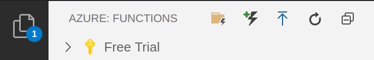
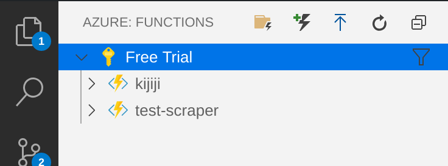
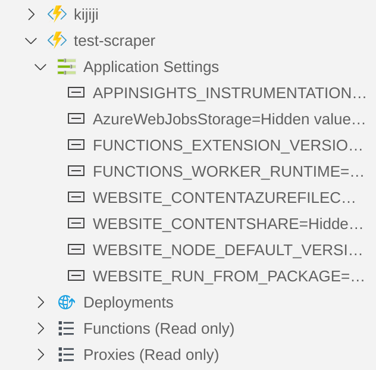
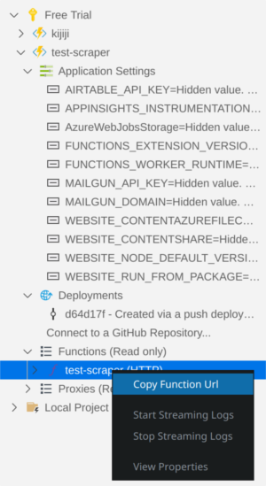

Serverless function are great because you don't need to have a server to run some tasks. In this example I will show you how to make a web scraper that will check for new content on a classifieds website [(kijiji.com)](https://kijiji.com) and send emails when it finds something new. I have setup a cronjob on a server to trigger my functions using a curl command.

We will be using [Airtable](https://airtable.com) for storing data, and [Mailgun](https://mailgun.com) to send emails.

If you have never [setup an Azure](azure-functions-vscode) function you can follow my example. That post will show you how you can setup an azure Function using VS code.

### Assumptions

* Understanding of JavaScript
* Know how to setup an Azure function
* Understand how to use NPM
* Know the basics of URL GET requests

## Outline

We will be doing the following in this article

1. [Set up web scraper](#setup-scraper-using-cheerio)
2. [Store ad Id in Airtable](#using-airtable)
3. [Send information with Mailgun](#send-emails-with-mailgun)
4. [View the complete function](#complete-function)
5. [Deploy the function](#deploy-function)

## Setup Scraper using Cheerio

When you have a blank http triggered Azure function setup we will first work on the setting up the web scraper. We are going to pass in the url of the page that we want to scrape with the request. To do this we are going to use a query parameter in the request url.

eg. `https://the-function-address.com/?url=https://example-url.com`

When we use ? after the initial url it means we are going to pass in some parameters. In this case we are using the parameter url with the value https://example-url.com. In our code we can get this value using `req.query.url`. This will give us the value that we pass in.

index.js
```js
module.exports = async function (context, req) {
    context.log('JavaScript HTTP trigger function processed a request.');

    if (req.query.url {
        context.res = {
            //Stuff goes here
        };
    }
    else {
        context.res = {
            status: 400,
            body: "Please pass in a URL you would like to scrape"
        };
    }
};
```

Cheerio is an open source packages that can be used to scrape information from an html page. It uses a jquery syntax for querying. So if you are familiar with that this will be easy. We will start by adding the package.

`npm install cheerio`

To get the html from the site we will use request-promise. This is an easy to use promise base html fetcher.

`npm install request-promise`

Then we will add these to our index file.

index.js
```javascript
const cheerio = require("cheerio")
const request = require("request-promise")

module.exports = async function (context, req) {
    context.log('JavaScript HTTP trigger function processed a request.');

    if (req.query.url) {
        //These are the options for the request
        let options = {
            uri: req.query.url,
            transform: body => {
                //After the request comes back we pass it through cheerio
                return cheerio.load(body)
            }
        }

        // This is where we make the request to fetch the page
        // The $ is a cheerio object that we will use to search
        // for elements
        const $ = await request(options)
        context.res = {
            //This is where the successful response goes
            body: 'It  was successful'
        }
    }
    else {
        context.res = {
            status: 400,
            body: "Please pass in a URL you would like to scrape"
        };
    }
}
```

Now we can use the $ to find elements in a page. This is done with a jquery like syntax. In our case we are going to find all of the regular ads on a page. They are identified with the class 'regular-ads'. So to find all the elements we use the following.

```javascript
const ads = $('.regular-ad')
```

This gives us an array of elements where the class is regular-ads. We can then grab information from these elements. To find a elements text we just need to use the text() function.

eg. `ad[0].text()` will return all of the text in the first ad.

We are going to gather some information for each of the ads scraped from the page. To do this we will make an array and then loop through the ads and gather the information for each ad.

```javascript
let newAds = [];
ads.each((i, ad) => {
    newAds.push(
        {
            title: $(ad).find("a.title").text(),
            id: $(ad).attr("data-listing-id"),
            price: $(ad).find(".price").text()
        }
    )
})
```

## Using Airtable

In this example we don't want to get all of the ads every time we scrape the page. This means that we need to store the last ad every time we run the function. To store this data we are going to use a service called Airtable. It is basically an online spreadsheet with a good api. To do this you will need to setup an airtable account and new table. In the table we will need to add the columns url and lastId.

For our function we will need to import the Airtable apk.

```javascript
npm install airtable
```

Then we can add it to the top of our function.

```javascript
const Airtable = require('airtable')
```

Now we will make a function to get the last Id from the table and if it doesn't have a record we will create one.

```javascript
LastId = async () => {
    const apiKey = process.env[AIRTABLE_API_KEY]
    let base = new Airtable({ apiKey }).base("{base-id}")

    const select = `({url} = "${url}")`;

    let row = await base("test-scraper")
        .select({
            view: "Grid view",
            filterByFormula: select,
        })
        .firstPage()

    if (row.length) {
        return row[0].fields.lastId
    }

    createNewRow(url)
    return
}
```

We will now create a function to add a new row if one was not found. This will set the base for adding a new id when we go through the ids.

```javascript
createNewRow = (url) => {
    const apiKey = process.env[AIRTABLE_API_KEY]
    let base = new Airtable({ apikey }).base("{base-id}")

    base("test-scraper").create(
        {
            "url": url
        }
    )
}
```

Side note about environment variables. For azure functions you can store local variables in local.settings.json.

```json
{
  "IsEncrypted": false,
  "Values": {
    "AzureWebJobsStorage": "",
    "FUNCTIONS_WORKER_RUNTIME": "node",
    "AIRTABLE_API_KEY": "api-key",
    "MAILGUN_API_KEY": "mailgun-key",
    "MAILGUN_DOMAIN": "mailgun-domain"
  }
}
```

Then you can access these with the process.env[VARIABLE_NAME]

This is our total function so far.

```javascript
const Cheerio = require("cheerio")
const Request = require("request-promise")
const Airtable = require("airtable")

module.exports = async function (context, req) {
    context.log('JavaScript HTTP trigger function processed a request.');

    if (req.query.url) {
        //These are the options for the request
        let options = {
            uri: req.query.url,
            transform: body => {
                //After the request comes back we pass it through cheerio
                return Cheerio.load(body)
            }
        }

        // This is where we make the request to fetch the page
        // The $ is a cheerio object that we will use to search for 
        // elements
        const $ = await Request(options)
        const ads = $('.regular-ad')
        let newAds = [];
        ads.each((i, ad) => {
            newAds.push(
                {
                    title: $(ad).find("a.title").text(),
                    id: $(ad).attr("data-listing-id"),
                    price: $(ad).find(".price").text()
                }
            )
        })

        let lastId = LastId(url)

        context.res = {
            //This is where the successful response goes
            body: JSON.stringify(newAds)
        };
    }
    else {
        context.res = {
            status: 400,
            body: "Please pass in a URL you would like to scrape"
        }
    }
}

const LastId = async(url) => {
    const apiKey = process.env[AIRTABLE_API_KEY]
    let base = new Airtable({ apiKey }).base("{base-id}")

    const select = 'AND(url = "' + url + '")'

    let row = await base("{table-name}")
        .select({
            view: "Grid view",
            filteredByFormula: select
        }).firstPage()

    if (row.length) {
        return row[0].fields.lastId
    }

    createNewRow(url)  
    return
}

const createNewRow = (url) => {
    const apiKey = process.env[AIRTABLE_API_KEY]
    let base = new Airtable({ apiKey }).base("{base-id}")

    base("{table-name}").create(
        {
            url: url
        }
    )
}
```

## Send Emails with Mailgun

When new ads are found we will send those ads to a given email address. To do this we will use a service called Mailgun, which is an api email delivery. You will need to setup an account and get the api key to use this api. You will also need to setup a domain to send from. This can be a sandbox account.

First add the Mailgun dependency to our project

`npm install mailgun-js`

Then add it to our imports at the top.

```javascript
const Cheerio = require("cheerio")
const Request = require("request-promise")
const Airtable = require("airtable")
const Mailgun = require("mailgun-js")
```

The function to send emails will look something like this. We get the api key and domain for Mailgun from the environment variables. Then we will send the email through Mailgun.

```javascript
const sendNotifications = (ad, email) => {
    const apiKey = process.env['MAILGUN_API_KEY']
    const domain = process.env['MAILGUN_DOMAIN']

    const mail = Mailgun({apiKey, domain})
    const data = {
        from: 'Kijiji Alerts <test@spencerwallace.ca>',
        to: email,
        subject: 'New Kijiji ad',
        template: 'kijiji-ad',
        "v:title": ad.title,
        "v:link": ad.link,
        "v:price": ad.price,
        "v:image": ad.image
    };

    mail.messages().send(data, function(err, body) {
        console.log(body)
    })
}
```

When we send this data to mailgun it will be using the template that we specify. In this case it is **kijiji-ad**. This is something that you will have to setup in mailgun. The template will then have access to the variables that we pass in. **title, link, price, image** which we can use to format an attractive email.

We will also need to add a second query parameter for our email address that we can pass in. At the top of our index function we will get the query parameter for email.

```javascript
const email = req.query.email
```

## Complete Function

Here is the full function with everything. It isn't the most clean function and can be refactored into separate files but for todays purposes we are going to keep it simple and all in one.

```js
const Cheerio = require("cheerio")
const Request = require("request-promise")
const Airtable = require("airtable")
const Mailgun = require("mailgun-js")

module.exports = async function (context, req) {
    context.log('JavaScript HTTP trigger function processed a request.');
    const url = req.query.url
    const email = req.query.email

    if (url && email) {
        //These are the options for the request
        let options = {
            uri: url,
            transform: body => {
                //After the request comes back we pass it through cheerio
                return Cheerio.load(body)
            }
        }

        // This is where we make the request to fetch the page
        // The $ is a cheerio object that we will use to search for 
        // elements
        const $ = await Request(options)
        const ads = $('.regular-ad')
        let allAds = ads.map((i, ad) => {
            return  {
                    title: $(ad).find("a.title").text(),
                    link: "https://kijiji.ca" + $(ad)
                    .find("a.title")
                    .attr("href"),
                    id: $(ad).attr("data-listing-id"),
                    price: $(ad).find(".price").text(),
                    image: $(ad).find("img").attr("src"),
                    }
                })

        // Get the last id from airtable
        let lastId = await LastId(url)

        // Gather up all the newAds
        let newAds = []
        // The each function is from the cheerio object
        // return false breaks the loop
        allAds.each((i, ad) => {
            if (ad.id === lastId) {
                return false
            }
            newAds.push(ad)
        })

        if (newAds.length) {
            let newestAdId = newAds[0].id
            saveNewestAdId(url, newestAdId)
            newAds.forEach((ad) => {
                sendNotifications(ad, email)
            })
        }

        context.res = {
            //This is where the successful response goes
            body: JSON.stringify(newAds)
        }
    }
    else {
        context.res = {
            status: 400,
            body: "You are missing an url from kijiji or an email in your request"
        }
    }
}

const LastId = async (url) => {
    const apiKey = process.evn["AIRTABLE_API_KEY"]
    //make sure to update the base code
    const base = new Airtable({ apiKey }).base("{base-code-from-airtable}")

    const select = `({url} = "${url}")`;

    //You will need to replace the table name
    let row = await base("{table-name}")
        .select({
            view: "Grid view",
            filterByFormula: select,
        })
        .firstPage()

    if (row.length) {
        return row[0].fields.lastId
    }

    createNewRow(url)
    return
}

const createNewRow = (url) => {
    const apiKey = process.evn["AIRTABLE_API_KEY"]
    //Replace base code
    const base = new Airtable({ apiKey }).base("{base-code-from-airtable")

    base("test-scraper").create(
        {
            "url": url
        }
    )
}

const saveNewestAdId = (url, id) => {
    const apiKey = process.evn["AIRTABLE_API_KEY"]
        .firstPage((err, records) => {
            if (err) {
                console.error(err)
                return
            }
            if (records.length === 1) {
                base("test-scraper").update(records[0].id,
                    {
                        lastId: id
                    }, (err, record) => {
                        if (err) {
                            console.error(err)
                            return
                        }
                    })
            }
        })
}

const sendNotifications = (ad, email) => {
    const apiKey = process.env['MAILGUN_API_KEY'];
    const domain = process.env['MAILGUN_DOMAIN'];

    const mail = Mailgun({apiKey, domain})
    const data = { 
        //change the email address to what you would like
        from: 'Kijiji Alerts <test@test.com>',
        to: email,
        subject: 'New Kijiji ad',
        template: 'kijiji-ad',
        "v:title": ad.title,
        "v:link": ad.link,
        "v:price": ad.price,
        "v:image": ad.image
    };

    mail.messages().send(data, function(err, body) {
        console.log(body)
    })

}
```

You can test the function by hitting F5 and running the function locally. Once the function is running it will give you the address to hit. Then you can either use an api testing program like postman or just use a browser. You will need to pass the two query parameters which are the url for the page we are scraping and the email address. The url would look something like this. 

```javascript
http://localhost:7071/api/test-scraper?url=https://www.kijiji.ca/b-free-stuff/medicine-hat/c17220001l1700231&email=test@test.com
```

This will grab all the adds for the page, log the latest ad id in airtable, send all of the ads to the email and then will return json of all the new ads. The second time it runs it shouldn't show any ads because it will only be showing ads that are newer than the ad id that we stored in airtable.

## Deploy Function

Now that we have the function running we can deploy it to the cloud. To do this we can use our vscode extension. Just click the deploy button at the top. The one with the arrow pointing up to a line.



It will then ask you to input some settings.

* Name of the function
* Data center to deploy to (Just pick something close to your location)

After it is deployed it will show up under your account. In my case it is under Free Trial account.



You will then need to add your environment variables. This is done by clicking the dropdown on the function and right clicking on Application Settings. You can either add the environment variables that you have locally by selecting **upload local settings** or adding them one by one by selecting **add new setting**. 



To get the address of the function click on functions and your function will show up. Then right click on the function and it will give you the option to **copy function url**. 



You can then use that url to trigger your function that you have deployed to the Azure cloud. In my case I setup a cron job that runs every 15 mins.

## Conclusion

Now that you know how to setup a serverless function the possibilities are endless. You can do all kinds of things that now don't require a server.

You can view the [source code](https://github.com/spenwall/scraper-example) for this project and make a pull request if you see something that needs fixing.
